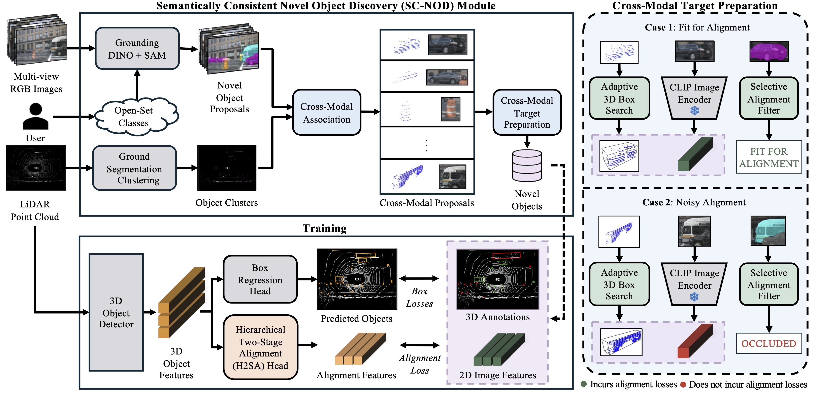

# OV-SCAN
## Semantically Consistent Alignment for Novel Object Discovery in Open-Vocabulary 3D Object Detection

&ensp;
[](https://opensource.org/licenses/MIT)&ensp;
[](https://arxiv.org/abs/2503.06435)&ensp;

> 📣 **Our paper has been accepted to ICCV 2025!**

OV-SCAN is an Open-Vocabulary 3D framework that enforces Semantically Consistent Alignment for Novel object discovery. It employs two core strategies:
1. Discovering precise 3D annotations
2. Filtering out low-quality or corrupted alignment pairs (arising from 3D annotation, occlusion-induced, or resolution-induced noise)

\
 
<p align="center"><em>Overall framework for OV-SCAN</em></p>

## Code
We will be releasing the code in the coming weeks. Stay tuned!

## Citation
If you use OV-SCAN in your research, please cite our paper:

```bibtex
@inproceedings{chow2025ovscan,
  title     = {OV-SCAN: Semantically Consistent Alignment for Novel Object Discovery in Open-Vocabulary 3D Object Detection},
  author    = {Adrian Chow and Evelien Riddell and Yimu Wang and Sean Sedwards and Krzysztof Czarnecki},
  booktitle = {Proceedings of the IEEE/CVF International Conference on Computer Vision (ICCV)},
  year      = {2025},
}
```
